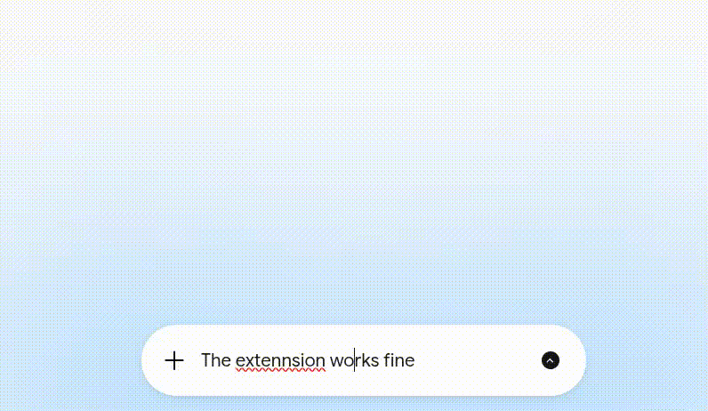
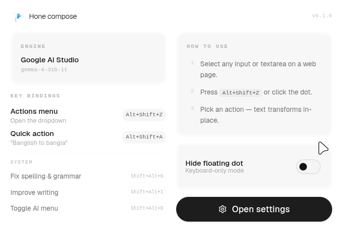
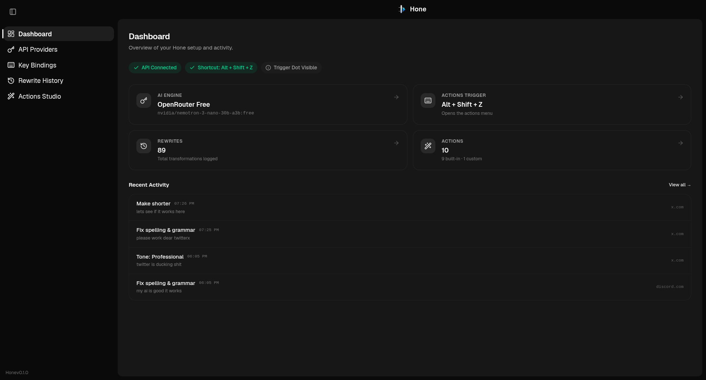
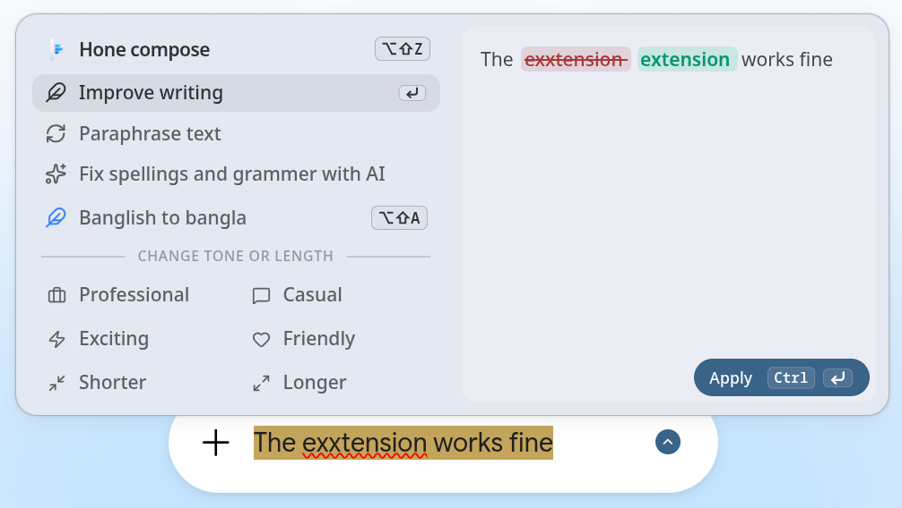
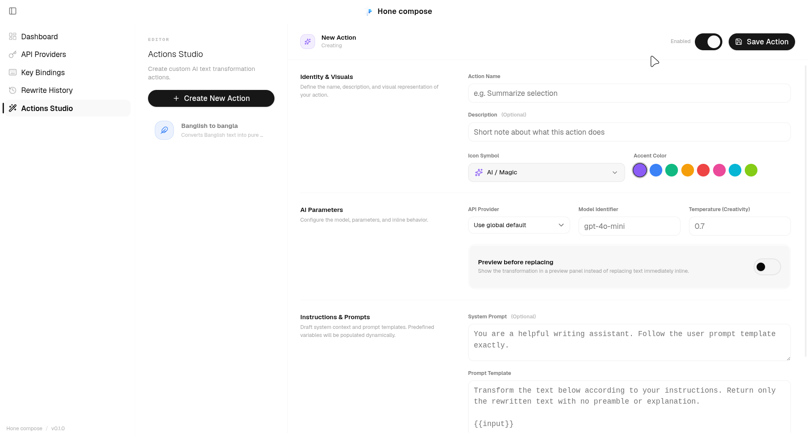

<div align="center">
  

  # Hone compose — AI Writing Assistant for the Web

  [](https://developer.chrome.com/docs/extensions/mv3/intro/)
  [](https://www.typescriptlang.org)
  [](https://react.dev)
  [](https://tailwindcss.com)
  [](https://ui.shadcn.com)
  [](https://www.radix-ui.com)
  [](https://lucide.dev)
  [](https://material-web.dev)

  **Hone is a professional-grade browser extension that brings modern LLM capabilities directly into any text box, editor, or textarea on the web.**
</div>

---

<br>

<table>
<tr>
<td width="33%" align="center">

### 🪄 Improve
Polish grammar, flow, and vocabulary in-place.

</td>
<td width="33%" align="center">

### 🔄 Paraphrase
Rewrite naturally while keeping the original meaning intact.

</td>
<td width="33%" align="center">

### ✅ Fix Spelling
Catch typos, grammar slips, and awkward phrasing instantly.

</td>
</tr>
<tr>
<td width="33%" align="center">

### 👔 Professional
Shift tone to business-appropriate with confidence.

</td>
<td width="33%" align="center">

### 💬 Casual
Make text conversational and easy to read.

</td>
<td width="33%" align="center">

### ⚡ Exciting
Add energy, enthusiasm, and engagement.

</td>
</tr>
<tr>
<td width="33%" align="center">

### ❤️ Friendly
Warm, polite, and approachable phrasing.

</td>
<td width="33%" align="center">

### 🔽 Shorter
Condense rambling text into crisp, direct sentences.

</td>
<td width="33%" align="center">

### 🔼 Longer
Expand brief notes into detailed, thorough prose.

</td>
</tr>
</table>

<p align="center">
  <strong>+ 🛠️ Custom Actions</strong> — the real power of Hone. Build your own AI tools tailored to your workflow. Assign them icons, colors, even per-action models. <em>This is what makes an open-source tool truly open-source — you're not stuck with what we built, you build what you need.</em>
</p>

---

## 🧠 Use Cases

Hone works wherever you type on the web. Here's what it does in plain language:

<dl>
  <dt><strong>📝 Polishing a work email</strong></dt>
  <dd>You draft a reply in Gmail, hit <kbd>Alt+Shift+D</kbd>, pick <em>Improve writing</em>, and Hone rewrites it to sound clear and professional — right inside the compose box.</dd>

  <dt><strong>✍️ Replying on social media</strong></dt>
  <dd>Writing a tweet or a Reddit comment that doesn't quite land? Select the text and ask Hone to make it <em>Casual</em> or <em>Friendly</em> so it reads naturally.</dd>

  <dt><strong>📄 Filling in a job application</strong></dt>
  <dd>You've typed a short answer in a textarea. Hone can <em>Lengthen</em> it to add detail, or shift to <em>Professional</em> tone before you submit.</dd>

  <dt><strong>🐛 Fixing a bug report</strong></dt>
  <dd>You wrote a rough description in GitHub Issues. Use <em>Fix spelling & grammar</em> to clean it up, then <em>Paraphrase</em> so it's clearer for the team.</dd>

  <dt><strong>💬 Chatting on Discord or WhatsApp Web</strong></dt>
  <dd>Hone integrates deeply with Slate.js (Discord) and Lexical (WhatsApp Web) — run actions directly inside rich-text editors without breaking formatting.</dd>

  <dt><strong>🗂️ Drafting a Notion doc or Google Doc</strong></dt>
  <dd>Write freely first, then refine sentence by sentence using any Hone action — no context switching to another tab or tool.</dd>

  <dt><strong>🎨 Creating custom writing tools</strong></dt>
  <dd><em>Actions Studio</em> lets you build your own AI-powered text tools. For example: create a <strong>"Summarize"</strong> action with the prompt <code>Summarize the following text into 3 bullet points: {{input}}</code>, assign it a <em>FileText</em> icon in purple, and bind it to <kbd>Alt+Shift+S</kbd>. It appears in your menu just like a built-in action — except you designed it for exactly what you need.</dd>

  <dt><strong>🔍 Reviewing before committing</strong></dt>
  <dd>Enable <em>Preview before replacing</em> on any action to see a before/after panel before applying changes to your text.</dd>
</dl>

---

## 🔌 API Providers

Hone is provider-agnostic. Bring your own API key — or use the preconfigured free tier.

| Provider | How to use | Pricing |
|---|---|---|
| **OpenRouter Free** | Get a free API key at [openrouter.ai](https://openrouter.ai). Hone auto-cycles through 5 free models (Gemma 4 26B, Nemotron 3 30B, Llama 3.2 3B, etc.) with up to 3 retry passes. | **Free-of-cost** with rate-limit fallback |
| **OpenRouter Paid** | Use any model slug from OpenRouter's catalog (GPT-4o, Claude, etc.). | Pay-as-you-go via OpenRouter credits |
| **OpenAI** | Bring your own `sk-proj-...` key. Supports custom endpoints (proxies, local gateways). | Your OpenAI plan |
| **Anthropic Claude** | Paste your `sk-ant-...` key from the Anthropic Console. | Your Anthropic plan |
| **Google Gemini** | Use a free API key from [aistudio.google.com](https://aistudio.google.com). Generous free tier. | **Free tier available** |
| **Google AI Studio** | Gemma models via `@google/genai` SDK with thinking config. Also uses aistudio keys. | **Free tier available** |

> **No API key? Start with OpenRouter Free** — sign up at openrouter.ai, grab a key, paste it in Hone's settings, and you're good to go. Zero cost.

---

## 🎨 Interactive Flow

```mermaid
graph TD
    User([User]) -->|Focuses text field| Trigger[✨ Hone Trigger Dot]
    Trigger -->|Click / Alt+Shift+D| Menu[Floating Action Menu]
    Menu -->|Select action| Engine[AI Provider Engine]
    Engine -->|Returns result| Preview[Before/After Preview Panel]
    Preview -->|Accept| Replace[Text Replaced In-Place]
    Preview -->|Discard| User

    style User fill:none,stroke:#666,stroke-width:2
    style Trigger fill:#1e1e2e,stroke:#cba6f7,stroke-width:2
    style Menu fill:#1e1e2e,stroke:#cba6f7,stroke-width:2
    style Engine fill:#1e1e2e,stroke:#89b4fa,stroke-width:2
    style Preview fill:#1e1e2e,stroke:#a6e3a1,stroke-width:2
    style Replace fill:#1e1e2e,stroke:#f9e2af,stroke-width:2
```



---

## ✨ Features — Deep Dive

### Text Actions

| Action | What it does |
|---|---|
| **Improve writing** | Enhances grammar, flow, vocabulary — makes any text polished and engaging |
| **Paraphrase** | Rewrites while preserving meaning — fresh wording, natural flow |
| **Fix spelling & grammar** | Corrects errors without changing tone or structure — powered by Harper.js for instant local checking |
| **Professional tone** | Shifts text to clear, business-appropriate language |
| **Casual tone** | Makes text conversational and easy to read |
| **Exciting tone** | Adds enthusiasm and energy |
| **Friendly tone** | Warms up the phrasing |
| **Shorter** | Condenses text to be direct and concise |
| **Longer** | Expands text with relevant detail and descriptive depth |
| **Custom actions** | User-defined prompts with custom icon, color, provider, model, and temperature |

### 🛠️ Actions Studio — Build Your Own Tools

Hone isn't limited to what we built. The **Actions Studio** is the heart of the project — it lets anyone create custom AI-powered text tools without writing code. You define the prompt, pick an icon and color, and it sits in your menu alongside the built-in actions. **That's the point: an open-source tool that you shape to fit your workflow, not the other way around.**

**Example — a "Summarize" tool:**
1. Click **Create New Action** in Actions Studio
2. Name it `Summarize`
3. Set the prompt template to: `Summarize this into 3 concise bullet points:\n\n{{input}}`
4. Pick the `FileText` icon, set color to purple
5. Optionally assign it to a specific provider/model
6. Save — it's now in your action menu on any website

**Everything you can configure:**
- **Prompt templates** with `{{input}}` variable — the selected text gets injected at rewrite time
- **System prompts** — set context/role instructions for the AI
- **Icon picker** — choose from 100+ Lucide icons to identify your action
- **Accent color** — pick from 8 preset colors for visual distinction
- **Per-action provider** — override the global provider for a specific action
- **Per-action model** — target a specific model for this action only
- **Temperature slider** — control creativity (0.0 = deterministic, 2.0 = max creativity)
- **Preview mode** — toggle before/after review panel instead of inline replacement
- **Enable/disable** — turn actions on/off without deleting them
- **Test playground** — run your action against sample text directly in the options page

### Smart Text Boundary Inference

When no text is selected, Hone intelligently guesses what you want to rewrite:

1. **Selection** — explicitly highlighted text
2. **Sentence** — auto-detected via regex
3. **Paragraph** — blank-line delimited block
4. **Full field** — entire editor contents

Cycle through options in the action menu with a single click.

### ⚡ Instant Spelling & Grammar with Harper.js

Hone integrates **Harper.js** — a well-known, open-source grammar checker that runs entirely in your browser via WebAssembly. This provides instant spelling and grammar corrections without sending your text to any external server.

**Why Harper.js?**
- **Privacy-First**: All grammar checking happens locally in your browser. Your text never leaves your device for spelling/grammar analysis.
- **Instant Response**: WebAssembly execution delivers sub-100ms correction times for typical text segments — no network latency.
- **No API Costs**: Unlike cloud-based grammar services, Harper.js is free to use with no rate limits or subscription fees.
- **Offline Capable**: Works without an internet connection once the WASM module is loaded.
- **SEO-Friendly**: Harper is a widely recognized name in the developer community, making Hone more discoverable for users searching for grammar checking solutions.

**How it works:**
1. When you select "Fix spelling & grammar," Hone first checks if the text is primarily English using Chrome's language detection API.
2. Harper.js runs locally as a WebAssembly module, analyzing your text for spelling errors, grammar mistakes, and awkward phrasing.
3. Corrections are displayed in the preview card with word-level diff visualization showing exactly what changed.
4. Smart fallback skips correction if too many errors are detected (indicating non-English text or gibberish).

**Performance:**
- WASM-based execution for near-native speed
- Language detection prevents unnecessary processing on non-English text
- Smart error threshold avoids false positives on code snippets or technical content

### Rich-Text Editor Compatibility

| Editor | Integration method |
|---|---|
| **Slate.js** (Discord) | React Fiber traversal, direct `editor.insertText()` call |
| **Lexical** (Facebook, WhatsApp Web) | `beforeinput` event with `insertReplacementText` |
| **ProseMirror** | Contenteditable-based DOM manipulation |
| **Twitter/X** | Custom editor adapter |
| **Native inputs** | `<input>`, `<textarea>` — via `execCommand` and value tracker |
| **Generic contenteditable** | Fallback DOM range manipulation |

### Keyboard Shortcuts

- **Menu toggle** — configurable combo (default: `Alt+Shift+D`) to open/close the floating action menu
- **Quick action** — configurable combo to run a specific action instantly without opening the menu
- **System commands** — manifest-level shortcuts that work even when websites intercept keystrokes
- **Shortcut recorder** — press any key combination to capture it in settings

### Configuration & Dashboard

The Options page gives you full control:

- **Dashboard** — at-a-glance status: API connection, active shortcuts, total rewrites, recent activity
- **API Providers** — manage keys, models, and endpoints for all 6 providers
- **Key Bindings** — record custom shortcuts, hide the floating dot (keyboard-only mode)
- **Rewrite History** — searchable, virtual-scrolled log with before/after detail view, copy, and delete
- **Actions Studio** — create, edit, and test custom actions

### UI Highlights

- **Modern shadcn/ui components** — built on Radix primitives for accessible, composable UI patterns
- **Material Web Components** — Google's Material Design 3 web components for dialogs, menus, switches, and buttons
- **Shadow DOM isolation** — page CSS can't leak into Hone's interface
- **Floating UI** — menu and preview panels follow the text caret automatically (flip, shift, collision detection)
- **Glassmorphic MD3 design** — Material Design 3 tokens with frosted-glass surfaces
- **Spring physics** — `cubic-bezier(0.175, 0.885, 0.32, 1.275)` for natural, bouncy micro-interactions
- **Web Audio API haptics** — buttons and switches produce tactile audio feedback
- **Trigger dot** — purple sparkle icon that appears when you focus any text field (toggleable)

---



<br>

## 📸 Showcase

<table>
  <tr>
    <td width="50%" align="center">
      
      <br><br>
      <strong>Extension Popup</strong><br>
      <span style="font-size:13px;color:#888;">Active engine, shortcuts & quick settings</span>
    </td>
    <td width="50%" align="center">
      
      <br><br>
      <strong>Options Dashboard</strong><br>
      <span style="font-size:13px;color:#888;">Status overview, metrics & recent activity</span>
    </td>
  </tr>
  <tr>
    <td width="50%" align="center">
      
      <br><br>
      <strong>In Action</strong><br>
      <span style="font-size:13px;color:#888;">Floating menu over a web text field</span>
    </td>
    <td width="50%" align="center">
      
      <br><br>
      <strong>Actions Studio</strong><br>
      <span style="font-size:13px;color:#888;">Build your own writing tools</span>
    </td>
  </tr>
</table>

<br>

---

## 🚀 Quick Start

### 1. Install

```bash
git clone https://github.com/rabden/hone-extension.git
cd hone
npm install
```

### 2. Build

```bash
npm run build
```

Outputs to `dist/`.

### 3. Load in Chrome

1. Open `chrome://extensions/`
2. Enable **Developer mode** (top-right)
3. Click **Load unpacked** (top-left)
4. Select the `dist/` directory

### 4. Add an API key

- Click the Hone icon in the toolbar, then **Open settings**
- Go to **API Providers**, pick your provider, paste your key
- Or grab a free key from [openrouter.ai](https://openrouter.ai) and select **OpenRouter Free**

### 5. Use it

Focus any text input on any webpage. Press `Alt+Shift+D` (default) or click the purple sparkle dot. Pick an action — your text transforms in-place.

---

## 📚 Technical Architecture

| Component | What it does |
|---|---|
| **Content Script** | Injected into every page. Renders the menu/preview UI in a Shadow DOM. Detects editor frameworks (Slate, Lexical, etc.) and adapts accordingly. |
| **Background Worker** | Routes AI requests to the configured provider. Handles OpenRouter Free model fallback cycling. Saves rewrite history. |
| **Main World Bridge** | Runs in the page's main JavaScript context. Traverses React Fiber trees to invoke editor event handlers that are inaccessible from the isolated world. |
| **Floating UI** | `@floating-ui/dom` for auto-positioning relative to the text caret (flip, shift, collision detection). |
| **Transaction Engine** | Low-level framework-specific commit logic — React Fiber walking, `beforeinput` events, `execCommand` — to inject rewritten text without breaking the host editor's state. |

> [!NOTE]
> For a deep dive into React Fiber traversal, editor adapter architecture, and file-by-file breakdown, see [architecture.md](architecture.md).

---

## 📄 License

This project is licensed under the MIT License. See [LICENSE](LICENSE) for details.
