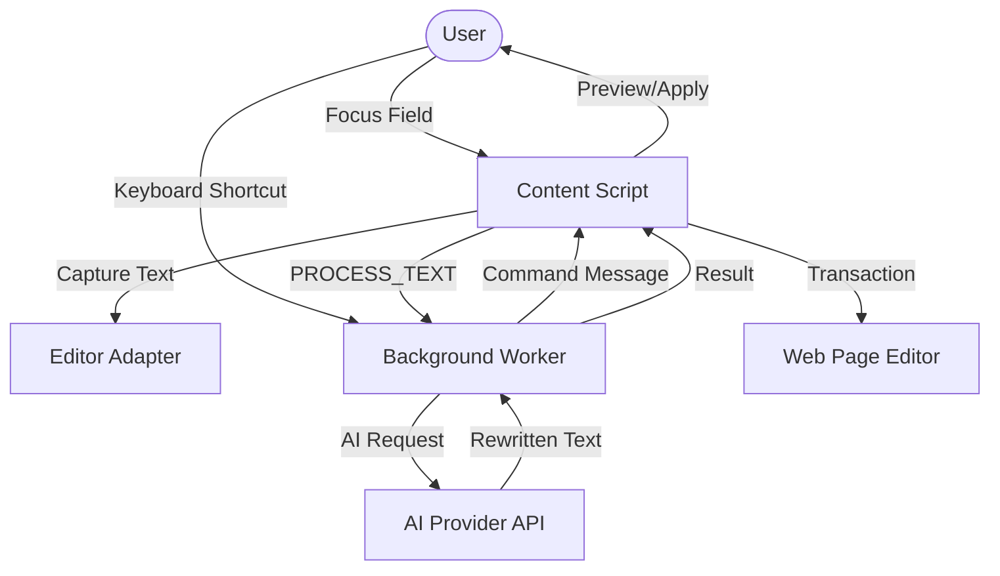

# Hone — AI Writing Assistant for the Web

Hone is a Chrome Extension (Manifest V3) that provides AI-powered writing tools (grammar fix, tone change, expansion, etc.) for any text input or textarea on any website. It features a sophisticated editor abstraction layer and a robust transaction engine to support both native HTML inputs and complex rich-text frameworks.

---

## 🏗️ Architecture Overview

The project is structured into three main execution environments, coordinated via Chrome's messaging system and shared storage.

### 🧩 System Flow


### 1. Content Script (`src/content/`)
Injected into every webpage. It handles UI rendering, user interaction, and editor manipulation.
- **Shadow DOM Isolation**: The UI is encapsulated in a Shadow Root to prevent style leaks. See [index.tsx](file:///disk2/desktop/extensions-A/src/content/index.tsx).
- **Adapter Pattern**: Abstracted interface for different editor types. See [adapters.ts](file:///disk2/desktop/extensions-A/src/content/adapters.ts).
- **Transaction Engine**: Sophisticated logic to inject text into rich-text editors (Slate, Lexical, etc.) without breaking their internal state. See [transaction-engine.ts](file:///disk2/desktop/extensions-A/src/content/transaction-engine.ts).
- **Positioning**: Calculates floating UI placement relative to the text caret. See [positioning.ts](file:///disk2/desktop/extensions-A/src/content/positioning.ts).

### 2. Background Service Worker (`src/background/`)
The extension's central nervous system.
- **AI Orchestration**: Routes prompts to OpenAI, Anthropic, Gemini, or OpenRouter. See [service-worker.ts](file:///disk2/desktop/extensions-A/src/background/service-worker.ts).
- **Retry Strategy**: Implements a cycle-based fallback for OpenRouter Free models.
- **Global Commands**: Listens for manifest-defined keyboard shortcuts.

### 3. Extension Pages (`src/popup/` & `src/options/`)
- **Popup**: Quick status view and toggle for the "Hone Dot". See [popup.tsx](file:///disk2/desktop/extensions-A/src/popup/popup.tsx).
- **Options**: Advanced configuration for API keys, Custom Actions, and Shortcut mapping. See [options.tsx](file:///disk2/desktop/extensions-A/src/options/options.tsx).

---

## 🛠️ Key Technical Deep-Dives

### **Editor Interaction (The "Nooks and Crannies")**
Interacting with web editors is the project's biggest challenge. Hone uses a tiered approach:
1. **Framework Detection**: [editor-detection.ts](file:///disk2/desktop/extensions-A/src/content/editor-detection.ts) identifies if an element is native, Lexical, Slate, or generic `contenteditable`.
2. **React Fiber Traversal**: To support editors like Discord (Slate), Hone traverses the React Fiber tree to find the internal `editor` instance. See `findSlateEditor` in [transaction-engine.ts](file:///disk2/desktop/extensions-A/src/content/transaction-engine.ts).
3. **Event Simulation**: Uses `beforeinput` with `insertReplacementText` or simulated `paste` events to ensure editors record the change in their undo/redo history.

### **AI Action System**
Actions are managed by the [ActionRegistry](file:///disk2/desktop/extensions-A/src/content/actions.ts).
- **Built-in Actions**: *Improve*, *Paraphrase*, *Fix Spelling*, *Tone Adjustments*, and *Length Adjustments*.
- **Custom Actions**: Users can define their own prompt templates (using `{{input}}` placeholders), models, and icons. These are stored in `chrome.storage.local`.

---

## 📂 Detailed File Tree & Responsibilities

```text
src/
├── background/
│   └── service-worker.ts      # [Core] AI provider routing, History management, Chrome Command listeners.
│                              # Functions: callAIProvider(), fetchOpenRouter(), saveToHistory().
├── components/
│   ├── ui/                    # [UI] Reusable Radix-based primitive components (Button, Card, Input, etc.).
│   ├── action-icon-select.tsx # [UI] Icon picker for custom actions.
│   └── hone-logo.tsx          # [UI] Brand assets.
├── content/
│   ├── actions.ts             # [Logic] ActionRegistry class. Manages built-in/custom prompts & icons.
│   ├── adapters.ts            # [Logic] EditableAdapter interface & implementations (Native, ContentEditable).
│   │                          # Functions: getSelection(), replaceRange(), getCaretRect().
│   ├── api.ts                 # [Utility] Robust fetch wrapper with AbortSignal, timeouts, and streaming support.
│   ├── app.tsx                # [Main] Root React component for the injected UI. Manages global state (menu, preview).
│   │                          # Hooks: useGSAP, useEffect (config sync), useCallback (apply transformation).
│   ├── content.css            # [Styles] Scoped styles for the Shadow DOM container.
│   ├── editor-detection.ts    # [Logic] Fingerprinting for Slate, Lexical, and Native editors.
│   ├── index.tsx              # [Entry] Mounts the React app into a Shadow Root with style isolation.
│   ├── keyboard-guard.ts      # [Logic] Prevents activation keys (Enter, Space) from leaking to host pages during preview.
│   ├── plain-text-dom.ts      # [Logic] DOM Range/Selection utilities for mapping plain text offsets to DOM nodes.
│   ├── positioning.ts         # [UI] Floating-UI integration for anchoring the menu to the text caret.
│   ├── preview-panel.tsx      # [UI] "Before/After" review panel for AI transformations.
│   ├── storage.ts             # [Data] Chrome Storage & IndexedDB (for History) abstraction layer.
│   └── transaction-engine.ts  # [Logic] Low-level framework commits (Slate React Fiber traversal, BeforeInput).
├── lib/
│   ├── action-icons.tsx       # [UI] Dynamic Lucide icon renderer for actions.
│   ├── shortcuts.ts           # [Utility] Formatting and labeling for keyboard shortcuts.
│   └── utils.ts               # [Utility] Tailwind-merge and Class-variance-authority helpers.
├── options/                   # [Page] Extension settings page (React).
└── popup/                     # [Page] Extension popup menu (React).
```

---

## 🚀 Development & Build

### **Vite Multi-Entry Configuration**
The project uses a custom [vite.config.ts](file:///disk2/desktop/extensions-A/vite.config.ts) that handles different build targets (popup, options, background, content) using environment variables (e.g., `ENTRY=background`).

### **Design System**
- **Theming**: Tailwind CSS 4 with a "Dark Mode" first approach.
- **Typography**: [Geist](https://vercel.com/font) and [Outfit](https://fonts.google.com/specimen/Outfit).
- **Primitives**: Radix UI for accessibility and performance.
