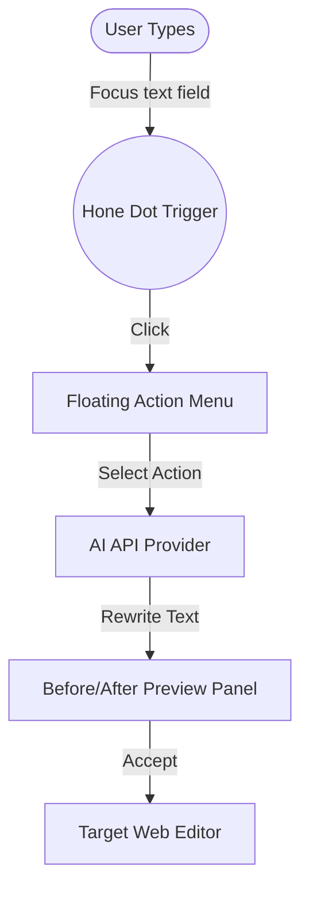

<div align="center">
  
  
  # Hone — AI Writing Assistant for the Web

  [](https://chrome.google.com/webstore)
  [](https://developer.chrome.com/docs/extensions/mv3/intro/)
  [](https://react.dev)
  [](https://tailwindcss.com)

  **Hone is a professional-grade browser extension that brings modern LLM capabilities directly into any text box, editor, or textarea on the web.**
</div>

---

## ✨ Features

- **🪄 Inline Magic**: Prompt-based text editing, rewrite suggestions, style refinement, and spelling fixes directly inline in any editor.
- **⚡ High-Fidelity Rich-Text Sync**: Custom transaction engine seamlessly updates React-controlled frameworks (Slate, Lexical, ProseMirror) and native inputs on platforms like Discord, WhatsApp Web, and Twitter/X.
- **🎨 Glassmorphic MD3 UI**: Elegant overlay elements built on Material Design 3, boasting physics-based spring easing and dynamic micro-animations.
- **🔊 Tactile Haptics**: Immersive Web Audio API haptic engine that generates clicking sound effects and tactile cues during UI interactions.
- **🔄 Multi-Model Orchestration**: Configure multiple API providers (OpenAI, Anthropic, Gemini, OpenRouter) with customizable system prompts and model profiles.
- **🔍 Smart Text Boundary Inference**: Intelligently infers edits at different granularity levels (selection, sentence, paragraph, full field) when no text is explicitly highlighted.

---

## 🎨 Interactive Overview

Hone floats beside your cursor, waiting to transform your text:



---

## 🚀 Quick Start

### 1. Installation
Clone the repository and install dependencies:
```bash
# Clone the repository
git clone https://github.com/rabden/hone-extension.git
cd hone

# Install dependencies
npm install
```

### 2. Build for Production
Compile all three execution environments (pages, background, content):
```bash
# Compile and build extension
npm run build
```
This outputs the compiled extension assets inside the `dist/` directory.

### 3. Load in Chrome
1. Open Google Chrome and navigate to `chrome://extensions/`.
2. Toggle **Developer mode** in the top-right corner.
3. Click **Load unpacked** in the top-left corner.
4. Select the `dist/` folder from the root of this project.

---

## ⚙️ Configuration

Open Hone's **Options Page** to customize your setup:
- **API Keys**: Add credentials for OpenAI, Anthropic, Gemini, or OpenRouter.
- **Custom Actions**: Define your own prompts, custom Lucide icons, and target colors.
- **Shortcuts**: Map custom key combinations (e.g. `Alt+Shift+D`) to launch Hone or execute specific actions instantly.
- **History Logs**: Review a local audit log of all previous rewrites and adjustments.

---

## 📚 Technical Specifications

Hone is engineered with high-performance browser extension architectures:
- **Shadow DOM Isolation**: Prevents stylesheet leaks from host websites from breaking Hone's UI.
- **Main World Bridge**: Traverses React Fiber trees natively to invoke component event handlers (`onChangeText`, `onChange`) directly in the page context.
- **Zero-Permission Policy**: Fully complies with minimal permission guidelines (requires only `storage` access; no clipboard or tab tracking).

> [!NOTE]
> For a detailed guide on the internal codebase structure, React Fiber traversals, and individual file responsibilities, refer to our [Architecture & Code Documentation](architecture.md).

---

## 📄 License
This project is licensed under the MIT License. See [LICENSE](LICENSE) for details.
