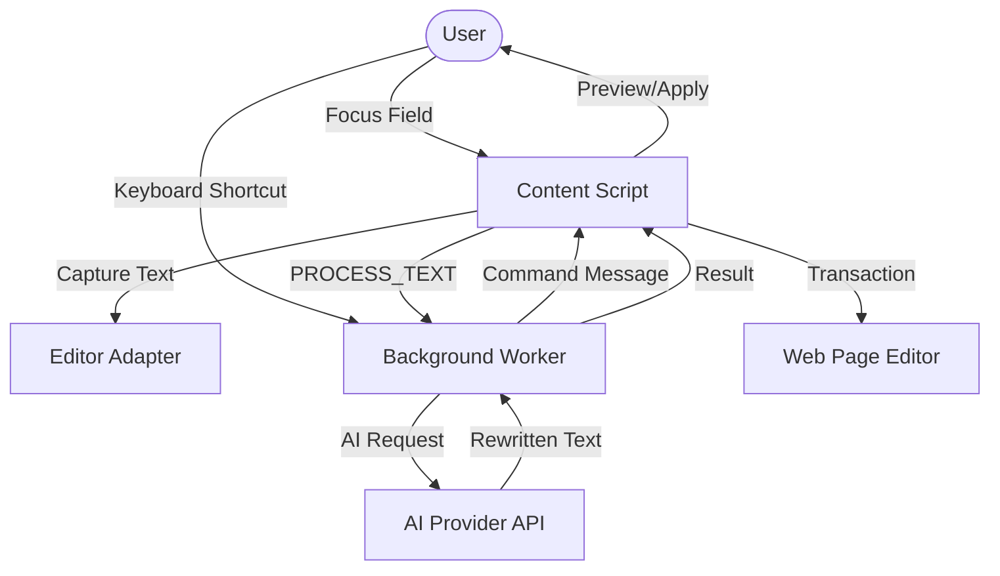

# Hone — Technical & Architecture Details

This document contains the low-level architectural details, file tree structure, framework interaction logic, and developer guides for the Hone AI Writing Assistant browser extension.

---

## 🧩 System Flow


---

## 🏗️ Architecture Design

The project is structured into three main execution environments, coordinated via Chrome's messaging system and shared storage:

### 1. Content Script (`src/content/`)
Injected into every webpage. It handles UI rendering, user interaction, and editor manipulation.
- **Shadow DOM Isolation**: The UI is encapsulated in a Shadow Root to prevent style leaks. Entry: [index.tsx](file:///disk2/desktop/extensions-A/src/content/index.tsx), UI: [app.tsx](file:///disk2/desktop/extensions-A/src/content/app.tsx).
- **Adapter Pattern**: Abstracted interface for different editor types. See [adapters.ts](file:///disk2/desktop/extensions-A/src/content/adapters.ts).
- **Transaction Engine**: Sophisticated logic to inject text into rich-text editors (Slate, Lexical, etc.) without breaking their internal state. See [transaction-engine.ts](file:///disk2/desktop/extensions-A/src/content/transaction-engine.ts).
- **Positioning**: Calculates floating UI placement relative to the text caret using Floating UI. See [positioning.ts](file:///disk2/desktop/extensions-A/src/content/positioning.ts).
- **Word-Level Diff**: LCS-based diffing algorithm for visualizing text changes. See [word-diff.ts](file:///disk2/desktop/extensions-A/src/content/word-diff.ts).
- **Local Grammar Checker**: Harper.js WASM integration for instant offline spelling/grammar correction. See [grammar-worker.ts](file:///disk2/desktop/extensions-A/src/content/grammar-worker.ts).
- **Rich Editor Orchestration**: High-level replacement logic that delegates to transaction-engine. See [rich-editor-replace.ts](file:///disk2/desktop/extensions-A/src/content/rich-editor-replace.ts).

### 2. Background Service Worker (`src/background/`)
The extension's central nervous system.
- **AI Orchestration**: Routes prompts to OpenAI, Anthropic, Gemini, or OpenRouter. See [service-worker.ts](file:///disk2/desktop/extensions-A/src/background/service-worker.ts).
- **Retry Strategy**: Implements a cycle-based fallback for OpenRouter Free models, attempting up to 15 different models sequentially.
- **Global Commands**: Listens for manifest-defined keyboard shortcuts (e.g., `toggle-menu`, `fix-spelling`).
- **Response Sanitization**: Sanitizes raw tag leakage (e.g. `</assistant>`, `</thought>`) inside service-worker before caching/display.

### 3. Extension Pages (`src/popup/` & `src/options/`)
- **Popup**: Quick status view, active provider display, and toggle for the "Hone Dot". Entry: [main.tsx](file:///disk2/desktop/extensions-A/src/popup/main.tsx), UI: [popup.tsx](file:///disk2/desktop/extensions-A/src/popup/popup.tsx).
- **Options**: Advanced configuration for API keys, Custom Actions, and Shortcut recording. Entry: [main.tsx](file:///disk2/desktop/extensions-A/src/options/main.tsx), UI: [options.tsx](file:///disk2/desktop/extensions-A/src/options/options.tsx).

---

## 🛠️ Key Technical Deep-Dives

### **Editor Interaction (The "Nooks and Crannies")**
Interacting with web editors is the project's biggest challenge. Hone uses a tiered approach:
1. **Framework Detection**: [adapters.ts](file:///disk2/desktop/extensions-A/src/content/adapters.ts) identifies if an element is native, Lexical, Slate, ProseMirror, Twitter, or generic `contenteditable` via DOM fingerprinting and React Fiber inspection.
2. **React Fiber Traversal**: To support editors like Discord (Slate) and Twitter/X (React Native Web Textareas), Hone traverses the React Fiber tree (`__reactFiber$`) in the page context (Main World) to find the internal `editor` instance or trigger event handler props (`onChange`, `onChangeText`, `onInput`) directly. See [main-world-bridge.ts](file:///disk2/desktop/extensions-A/src/content/main-world-bridge.ts) and [transaction-engine.ts](file:///disk2/desktop/extensions-A/src/content/transaction-engine.ts).
3. **Event Simulation**: Uses `beforeinput` with `insertReplacementText` or simulated `paste` events to ensure editors record the change in their undo/redo history.
4. **Context Snapshotting**: Before replacement, the system captures the current text span location to handle cases where the editor content may have changed between selection and application.

### **Advanced UI Components**
The project includes high-fidelity custom components designed for a native-like feel:
- **Haptic Feedback**: Custom components like `MaterialDesign3Button` and `MaterialDesign3Switch` include a **Web Audio API** based haptic engine that generates "tactile pop" sounds and vibration-like audio cues.
- **Physics-based Animations**: Custom ripple hooks and spring-based easing (`cubic-bezier(0.175, 0.885, 0.32, 1.275)`) provide high-quality interaction feedback.
- **2-Column Menu Layout**: The floating action menu uses a split design with actions on the left and a preview card on the right, allowing users to review AI results before applying. See [floating-action-menu.tsx](file:///disk2/desktop/extensions-A/src/content/floating-action-menu.tsx).
- **Dynamic Sizing**: The preview card automatically adjusts its height and width based on content and available viewport space using `useLayoutEffect` and `useEffect`.

### **Local Grammar & Spelling with Harper.js**
Hone integrates Harper.js (a well-known open-source grammar checker) for instant, offline spelling and grammar correction:
- **WASM Module**: Harper.js runs as a WebAssembly module in a dedicated worker ([grammar-worker.ts](file:///disk2/desktop/extensions-A/src/content/grammar-worker.ts)).
- **Language Detection**: Uses Chrome's `chrome.i18n.detectLanguage` API to determine if text is primarily English before applying corrections.
- **Smart Fallback**: Skips correction if too many spelling errors are detected (indicating non-English text or gibberish).
- **Privacy-First**: All processing happens locally in the browser — no text is sent to external servers for grammar checking.
- **Instant Response**: Local WASM execution provides sub-100ms response times for typical text segments.

### **Word-Level Diff Visualization**
The [word-diff.ts](file:///disk2/desktop/extensions-A/src/content/word-diff.ts) module implements a Longest Common Subsequence (LCS) algorithm for computing word-level differences:
- **Tokenization**: Groups words with trailing whitespace to preserve formatting during diffing.
- **LCS Algorithm**: Dynamic programming approach to find the longest common subsequence between original and rewritten text.
- **Performance Fallback**: For very large texts (>10,000 characters), uses a simplified diff to prevent UI freezing.
- **Token Merging**: Consecutive tokens of the same type (add/remove) are merged for cleaner presentation.
- **Alternating Collapse**: Alternating add/remove runs are collapsed into single replacement blocks for intuitive diff display.

### **Inference Level System**
When no text is explicitly selected, Hone intelligently infers the target scope:
- **Selection**: Explicitly highlighted text (highest priority)
- **Sentence**: Auto-detected via regex pattern matching
- **Paragraph**: Blank-line delimited text blocks
- **Full Field**: Entire editor contents
Users can cycle through these levels in the action menu to fine-tune the rewrite scope.

---

## 📂 Detailed File Tree & Responsibilities

```text
src/
├── background/
│   └── service-worker.ts      # [Core] AI provider routing, API fallbacks, IndexedDB/Storage history syncing, and prompt response sanitization.
├── components/
│   ├── ui/                    # [UI] Radix-based primitives and custom MD3 components.
│   │   ├── badge.tsx          # Unified badge component with variant support.
│   │   ├── button.tsx         # Base Radix-slot button with Tailwind variants.
│   │   ├── card.tsx           # Compound components for structured panels (Title, Description, Content, Footer).
│   │   ├── input.tsx          # Styled HTML input with focus ring and invalid state handling.
│   │   ├── label.tsx          # Accessible Radix label primitive.
│   │   ├── material-design-3-button.tsx # Custom button with Web Audio haptics and ripple physics.
│   │   ├── material-design-3-switch.tsx # Custom switch with audio feedback and spring animations.
│   │   ├── material-dialog.tsx # Styled accessible dialog box primitive utilizing Radix Dialog.
│   │   ├── menu.tsx           # Accessible cascading menu UI using Radix Dropdown Menu.
│   │   ├── modern-dropdown.tsx # Custom dropdown list overlay with keyboard selection logic.
│   │   ├── ripple.tsx         # Styled micro-animation background element for touch/click ripple effects.
│   │   ├── scroll-area.tsx    # Styled scrollbar wrapper with hide-on-idle styling.
│   │   ├── select.tsx         # Complex Radix select with viewport scrolling and portal support.
│   │   ├── separator.tsx      # Accessible decorative separator.
│   │   ├── sheet.tsx          # Slide-out panel element for side options drawer (Radix Dialog).
│   │   ├── sidebar.tsx        # Accessible sidebar navigation shell with Collapsible states.
│   │   ├── skeleton.tsx       # Loading state placeholder block element.
│   │   ├── switch.tsx         # Base Radix switch primitive.
│   │   ├── tabs.tsx           # Multi-variant Radix tabs (default and line styles).
│   │   ├── textarea.tsx       # Auto-sizing textarea with integrated focus styling.
│   │   └── tooltip.tsx        # Radix-based hover tooltip element for auxiliary labels.
│   ├── action-icon-select.tsx # [UI] Custom accessible icon picker with keyboard navigation.
│   ├── hone-logo.tsx          # [UI] SVG brand asset with sizing props.
│   └── material-registry.tsx  # [Logic] Client-side dynamic imports for registering Material Web Components.
├── content/
│   ├── actions.ts             # [Logic] ActionRegistry class. Manages built-in/custom prompts & icons.
│   ├── adapters.ts            # [Logic] EditableAdapter interface & implementations (Native Input, ContentEditable, Slate, Lexical, ProseMirror, Twitter).
│   │                          # Bypasses React state using execCommand and valueTracker resets. Handles boundary text inferences.
│   ├── api.ts                 # [Utility] Robust fetch wrapper with AbortSignal, timeouts, and streaming support.
│   ├── app.tsx                # [Main] Root React component for the injected UI. Manages global state (menu, preview).
│   │                          # Handles focus tracking, scroll/resize updates, and keyboard event interception.
│   ├── content.css            # [Styles] Scoped styles for the Shadow DOM container.
│   ├── floating-action-menu.tsx # [UI] 2-column floating menu with action list and preview card.
│   ├── grammar-worker.ts      # [Logic] Harper.js WASM integration for local spelling/grammar checking.
│   ├── index.tsx              # [Entry] Mounts the React app into a Shadow Root with style isolation and injects main-world-bridge.js.
│   ├── main-world-bridge.ts   # [Bridge] Standard isolated world bypass allowing direct React/Slate Fiber interactions from the main world.
│   ├── positioning.ts         # [UI] Floating-UI integration for anchoring the menu to the text caret.
│   ├── rich-editor-replace.ts # [Logic] High-level replacement orchestration for rich-text editors.
│   ├── storage.ts             # [Data] Chrome Storage & IndexedDB (for History) abstraction layer.
│   ├── transaction-engine.ts  # [Logic] Low-level framework transaction commits (Slate React Fiber bridge traversal, BeforeInput, ExecCommand, Paste).
│   └── word-diff.ts           # [Logic] Word-level LCS diff algorithm for visualizing text changes.
├── hooks/
│   └── use-mobile.ts          # [Utility] Responsive breakpoint hooks targeting mobile layouts.
├── lib/
│   ├── action-icons.tsx       # [UI] Dynamic Lucide icon renderer for actions.
│   ├── shortcuts.ts           # [Utility] Formatting and labeling for keyboard shortcuts.
│   └── utils.ts               # [Utility] cn() helper using tailwind-merge and clsx.
├── options/                   # [Page] Extension settings page (React).
│   ├── main.tsx               # Entry point for the options page.
│   └── options.tsx            # Main options UI with API, Shortcut, History, and Actions tabs.
├── popup/                     # [Page] Extension popup menu (React).
│   ├── main.tsx               # Entry point for the popup.
│   └── popup.tsx              # Quick status and settings toggle UI.
├── types/
│   └── material-web.d.ts      # TypeScript definitions for Material Web Components.
├── App.css                    # Vite template styles.
├── App.tsx                    # [Dev] Vite template landing page (not in production bundle).
├── index.css                  # Global Tailwind imports and base styles.
├── main.tsx                   # [Dev] Entry point for the Vite development landing page.
```

---

## Marketplace Registry

The Hone Actions Registry is a public GitHub repo that acts as a curated catalog of community-contributed actions. All installed marketplace actions are fetched directly from this repo (not bundled with the extension).

### Repo Location
- **URL**: `github.com/rabden/Hone-Actions-Registry`
- **Base raw URL**: `https://raw.githubusercontent.com/rabden/Hone-Actions-Registry/main/`

### Registry Files

| File | Purpose |
|---|---|
| `registry.json` | Index of all available actions (id, name, icon, color, path, tags) |
| `schema.json` | JSON Schema that validates individual action JSON files |
| `actions/*.json` | Individual action definitions (one file per action) |
| `scripts/validate.js` | CI validation script |
| `CONTRIBUTING.md` | Contribution guidelines |

### `registry.json` Structure

The registry is an index. Each entry is:

```ts
interface RegistryAction {
  id: string;        // e.g. "mkt_action_items"
  name: string;      // Display name
  description: string;
  icon: string;      // Lucide icon name (PascalCase, e.g. "ListChecks")
  color: string;     // Hex color for the icon
  version: string;   // Semver
  author: string;    // GitHub username or team
  tags: string[];    // Lowercase kebab-case tags
  path: string;      // Relative path to action JSON, e.g. "actions/action-items.json"
}
```

### Action JSON File Fields

Each `actions/*.json` file is validated against `schema.json` and contains:

```ts
{
  id: "mkt_<name>",        // Pattern: ^mkt_[a-z0-9_]+$, max 64 chars
  name: string,            // 3-80 chars
  description: string,     // 10-160 chars
  icon: string,            // PascalCase Lucide name
  color: string,           // Hex #RRGGBB
  promptTemplate: string,  // 20-4000 chars, must contain {{input}} placeholder
  systemPrompt?: string,   // Optional, max 12000 chars
  category: "marketplace", // Always "marketplace"
  version: string,         // Semver
  author: string,          // 2-60 chars
  tags: string[]           // 1-6 lowercase kebab-case tags, max 24 chars each
}
```

**No `provider`, `model`, `temperature`, or `replaceMode` fields** exist in the schema. Those are configured by the user in the editor after installation and stored locally with the action config.

### How the Extension Interacts

- **Fetching the catalog**: `handleFetchRegistry()` in `src/background/service-worker.ts:561` fetches `registry.json` and caches it for 6 hours (`REGISTRY_CACHE_TTL_MS`). The `ActionsStudioTab` in the options page sends a `MARKETPLACE_FETCH_REGISTRY` message to trigger this.
- **Installing an action**: `handleInstallAction()` in `src/background/service-worker.ts:590` fetches the individual action JSON, validates each field (never blind-spreads), constructs a `CustomAction` with `type: 'marketplace'` and `category: 'custom'`, and saves it via `saveActionConfig()`.
- **Storage schema**: Installed marketplace actions use the same `CustomAction` interface (`src/content/storage.ts:14`) as user-created custom actions, distinguished by `type: 'marketplace'` and `sourceId` tracking the registry ID.
- **Runtime execution**: The `ActionRegistry` (`src/content/actions.ts:36`) loads all enabled actions (builtin, custom, marketplace) at startup from local storage. The service worker (`callAIProviderRaw()`) routes AI requests using the user's global provider setting -- per-action provider/model fields are not currently read at runtime.
```
